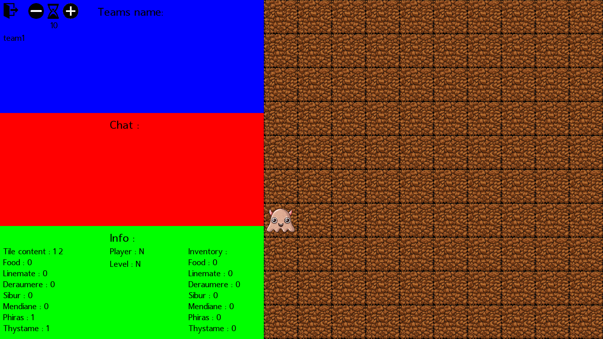
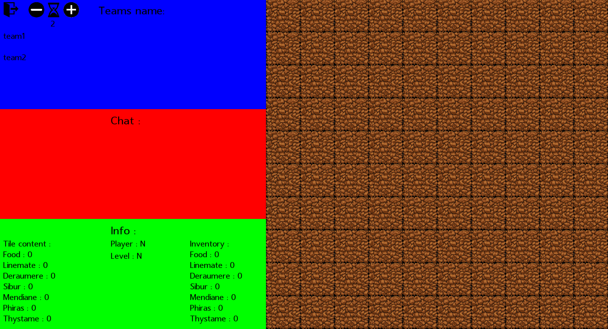
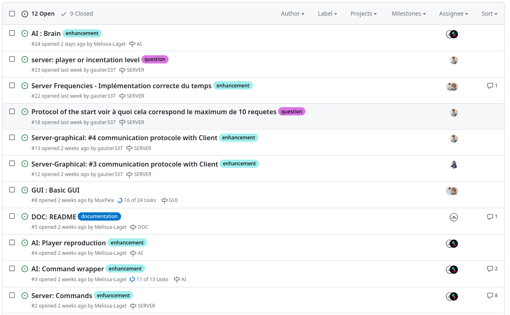

# Zappy project :video_game:

## Done by Melissa, Maxime, Gauthier, Hugo, Max and Nicolas - Epitech 2023 :mortar_board:

### Overview :eyes:

This project is a part of the **second** year of Epitech. <br>
It was made in **groups of 6**, and it was our final project of the year. <br>
We had **1 month** to complete it. :spiral_calendar: <br>

The goal of this project was to create a **game** in **C**, **C++** and **python**. <br>
The game is a **multiplayer** game where you have to **collect resources** and **elevate yourself**. <br>
The game is composed of a **server** made in C :computer:, an **AI** made in python :robot: and a **graphic interface** made in C++ :art:. <br>

### Running the project locally :building_construction:

* Clone this repository locally
* Run `make zappy` in your bash / command line
* And run `./zappy_<server|ai|gui> <options>`

You can **run** each binary separately or together. <br>

* To run the server, you have to run `make zappy_server && ./zappy_server <options>`
* To run the AI, you have to run `make zappy_ai && ./zappy_ai <options>`
* To run the graphic interface, you have to run `make zappy_gui && ./zappy_gui <options>`
* To run all of them, you have to run `make zappy && ./zappy_<server|ai|gui> <options>`

To try this program, you can to use this **command**: :computer: <br>

```bash
make zappy && ./zappy_<server|ai|gui> <options>
```

There are 3 binaries in this project: <br>

- `zappy_server` : the server of the game
  Where the **options** are:
    - `-p` : the port of the server
    - `-x` : the width of the map
    - `-y` : the height of the map
    - `-n` : the name of the teams
    - `-c` : the number of clients allowed at the same time on the server on the same team (default: 2)
    - `-f` : the frequency of the server (default: 2)
- `zappy_ai` : the AI of the game
  Where the **options** are:
    - `-p` : the port of the server
    - `-n` : the name of the teams
    - `-h` : the name of the machine; `localhost` by default
- `zappy_gui` : the graphic interface of the game
  Where the **options** are:
    - `-p` : the port of the server
    - `-h` : the name of the machine; `localhost` by default

<br>

> **Warning**
>
> Make sure you have the **SFML** library installed on your computer.
> <br>
> If you don't, the gui part of the project will **not compile**. <br>

<br>

> **Warning**
> 
> Make sure you have the **python 3.11** library installed on your computer.
> <br>
> If you don't, the **AI** part of the project will **not run**. <br>
> If you want to build the **AI** part using **Nuitka**, you will also need patchelf and the python headers (python3-devel on fedora).

<br>

In example, you can run the server with this command: <br>

```bash
./zappy_server -p 8000 -x 10 -y 10 -n team1 team2 -f 2
```

Or, you can run the AI with this command: <br>

```bash
./zappy_ai -p 8000 -n team1
```

Or, you can run the graphic interface with this command: <br>

```bash
./zappy_gui -p 8000
```

### How to play :video_game:

The goal of the game is to have at least 6 players of your team to elevate to the maximum elevation, level 8. <br>
To do that, you have to collect resources and elevate yourself. <br>
You can collect resources by moving on it and then take it. <br>
You can elevate yourself by collecting resources and then do an `incantation`. <br>
You have to **be careful** because you can **die** if you don't have enough food. <br>
You can also **communicate** with other players by sending messages using the `broadcast <msg>` command. <br>

The different **commands** you can use are: <br>

| Action                       | Command        | Time limit | Response                                  |
|------------------------------|----------------|------------|-------------------------------------------|
| move up one tile             | Forward        | 7/f        | ok                                        |
| turn 90° right               | Right          | 7/f        | ok                                        |
| turn 90° left                | Left           | 7/f        | ok                                        |
| look around                  | Look           | 7/f        | [tile1, tile2,. . . ]                     |
| inventory                    | Inventory      | 7/f        | [linemate n, sibur n,. . . ]              |
| broadcast text               | Broadcast text | 7/f        | ok                                        |
| number of team unused slots  | Connect_nbr    | -          | value                                     |
| fork a player                | Fork           | 42/f       | ok                                        |
| eject players from this tile | Eject          | 7/f        | ok/ko                                     |
| death of a player            | -              | -          | dead                                      |
| take object                  | Take object    | 7/f        | ok/ko                                     |
| set object down              | Set object     | 7/f        | ok/ko                                     |
| start incantation            | Incantation    | 300/f      | Elevation underway && Current level: k/ko |
| bad command                  | -              | 7/f        | ko                                        |

Here is the different **resources** you can collect: <br>

- `food` : food to eat
- `linemate` : stone to elevate yourself
- `deraumere` : stone to elevate yourself
- `sibur` : stone to elevate yourself
- `mendiane` : stone to elevate yourself
- `phiras` : stone to elevate yourself
- `thystame` : stone to elevate yourself

Here is what you need to **elevate yourself** from the different levels: <br>

- `level 1 to level 2` : 1 player, 1 linemate, 0 deraumere, 0 sibur, 0 mendiane, 0 phiras, 0 thystame
- `level 2 to level 3` : 2 players, 1 linemate, 1 deraumere, 1 sibur, 0 mendiane, 0 phiras, 0 thystame
- `level 3 to level 4` : 2 players, 2 linemate, 0 deraumere, 1 sibur, 0 mendiane, 2 phiras, 0 thystame
- `level 4 to level 5` : 4 players, 1 linemate, 1 deraumere, 2 sibur, 0 mendiane, 1 phiras, 0 thystame
- `level 5 to level 6` : 4 players, 1 linemate, 2 deraumere, 1 sibur, 3 mendiane, 0 phiras, 1 thystame
- `level 6 to level 7` : 6 players, 1 linemate, 2 deraumere, 3 sibur, 0 mendiane, 1 phiras, 0 thystame
- `level 7 to level 8` : 6 players, 2 linemate, 2 deraumere, 2 sibur, 2 mendiane, 2 phiras, 1 thystame

### Output :outbox_tray:

An **output** you can get from this program can be:




### Tools and languages used :hammer_and_wrench:

[](https://github.com/tandpfun/skill-icons)

### Commit norm :keyboard:

Here, you can find our [commit norm](doc/COMMIT.md). :memo:

### Organization :file_folder:

To organize our work, we used a **GitHub project**. <br>
We made **issues** and **branches** to work on the project. <br>
We also made **milestones** to know what we had to do in which part, like the server, the AI or the graphic interface or the documentation. <br>



Here is the link of our [**GitHub project**](https://github.com/orgs/EpitechPromo2026/projects/727). :octocat:

We also gave us **roles** to know who had to do what. <br>
- **Gautier**, **Melissa**, **Nicolas**, **Max**, **Hugo** and **Maxime**: server
- **Maxime** and **Melissa**: AI
- **Max** and **Hugo**: graphic interface


### Our GitHub accounts: :octocat:

<div align="center" href="">
<table>
    <td align="center">
        <a href="https://github.com/Ackfire">
            
            <br />
            <b>LAGET Melissa</b>
        </a>
        <br />
        <a href="mailto:melissa.laget@protonmail.com">📧</a>
    </td>
    <td align="center">
        <a href="https://github.com/RedCommand">
            
            <br />
            <b>SENARD Maxime</b>
        </a>
        <br />
        <a href="mailto:maxime.senard@epitech.eu">📧</a>
    </td>
    <td align="center">
        <a href="https://github.com/Hugo-code-dev">
            
            <br />
            <b>DUBOIS Hugo</b>
        </a>
        <br />
        <a href="mailto:hugo.dubois@epitech.eu">📧</a>
    </td>
    <td align="center">
        <a href="https://github.com/gautier337">
            
            <br />
            <b>BONHUR Gautier</b>
        </a>
        <br />
        <a href="mailto:gautier.bonhur@epitech.eu">📧</a>
    </td>
    <td align="center">
        <a href="https://github.com/MaxPeix">
            
            <br />
            <b>PEIXOTO Max</b>
        </a>
        <br />
        <a href="mailto:max.peixoto@epitech.eu">📧</a>
    </td>
    <td align="center">
        <a href="https://github.com/nicolas-sainty">
            
            <br />
            <b>SAINTY Nicolas</b>
        </a>
        <br />
        <a href="mailto:nicolas.sainty@epitech.eu">📧</a>
    </td>

</table>

</div>

:+1: Thanks for reading this documentation ! :page_facing_up:
